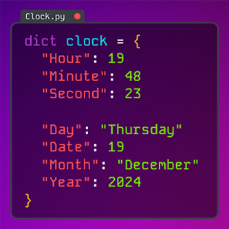

*Rainmeter is a free, open-source tool for creating visualizations and dashboards.*

I created a Rainmeter skin for displaying component usage, time and more in a sleek, developer-inspired coding aesthetic.

## Design & Features

It's still in active development and I plan to add custom color theme settings, search engine selector, and extra desktop widgets such as music control and disk usage monitoring.

For the visual design, I was inspired by the atmospheric [wallpaper created by Probler](https://steamcommunity.com/sharedfiles/filedetails/?id=3025013651).

