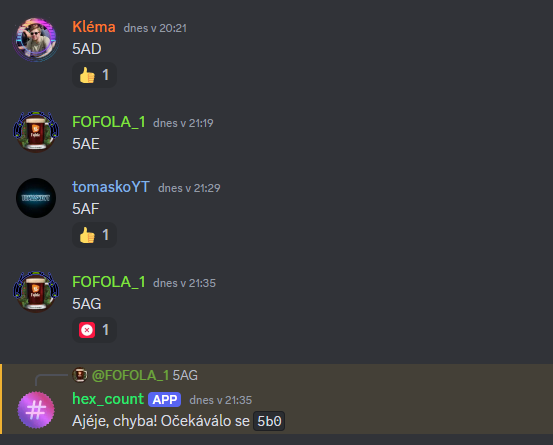

*Discord is a platform that goes beyond chatting — it also allows developers to build apps, bots, and interactive experiences directly inside servers.*

I've created this Discord bot for fun and increasing engagement and activity on community servers.

## Features & Gameplay Mechanics

The bot validates counting streaks in multiple base systems including hex, decimal, binary, and roman numerals.

It's still in active development and features custom rule configuration, leaderboard stats, and error handling.

