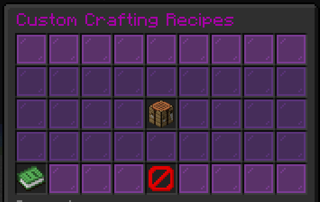

*Minecraft is an open-world sandbox game where plugins enable endless customization and server gameplay mechanics.*

I created a Minecraft plugin for custom crafting recipes, allowing server administrators and players to define unique recipes easily through intuitive configuration files.

## Customization & Mechanics

The plugin allows full customization of grid inputs, resulting items, and special item flags.

Future updates will introduce graphical user interface (GUI) editing tools and per-permission recipe unlocks.

